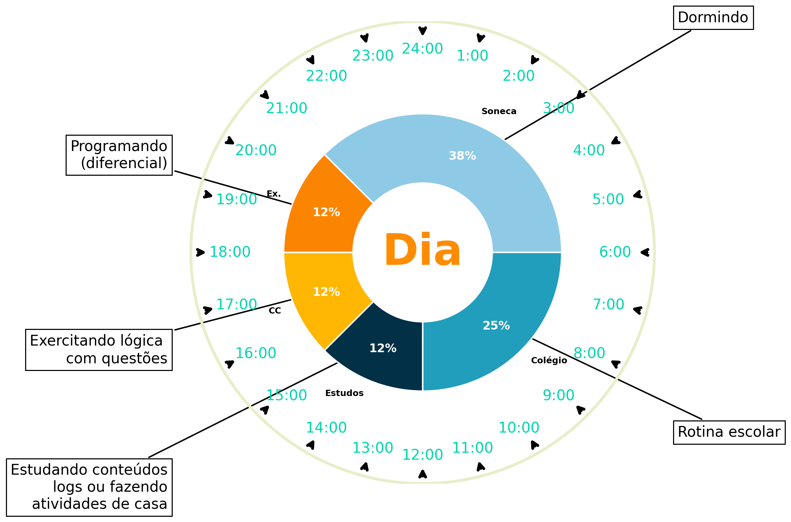

# OEDI 2026
 Organização Essencial de Desenvolvimento Intelectual 2026



---
## Regras a se modificar o plano
Fazer simples, executável e constante (vence complexo e perfeito).
## Objetivos
### Metas Rasas (curto prazo)
 ~~- Tocar qualquer música via **piano**.~~

 - Conseguir primeiro ganho em dinheiro através de desenvolvimento de sites até data 25/08

 - ~~**Game** que retorne remuneração.~~

 - ~~Adquirir ganhos a partir das **tecnologias** estudadas (Linguagem de programação, construção de site etc.).~~

 - ~~**Negócio** de tecnologia.~~

### Metas Altas (longo prazo)
 - ~~Tornar-se **versado** no ramo de **tecnologia**.~~

 - ~~Criar **máquina IA**.~~

 - ~~Fazer o **dinheiro** trabalhar por mim.~~

 - ~~Tornar-se **rico**.~~

 - Cursar Ciência da Computação em uma dessas instituições de ensino: USP, UFMG mediante **Enem**.

 - ~~Ingressar no **MIT** (ou outras universidades de excelência no exterior).~~

 - ~~Ter **negócios** -nomeadamente empresa de tecnologia- de sucesso.~~

 - ~~Tornar-se **investidor** bem-sucedido.~~

### Conclusões de Estudos Mensais:
 - [x] Jan (Ações praticadas)
 - [ ] Fev (Estagnação de sobrecarga de estudos / repaginação das metas e das ações)
 - [ ] Mar
 - [ ] Abr
 - [ ] Mai
 - [ ] Jun
 - [ ] Jul
 - [ ] Ago
 - [ ] Set
 - [ ] Out 
 - [ ] nov
 - [ ] Dez

## Ação
 - ~~Ler **livro** (intercalar com livros de assunto do estudo atual). ***Bloco N***~~

 - ~~Cursar **piano**/teclado. ***Bloco N***~~

 - Fazer os seguintes projetos com html e css e js:
   1. Site Meu portifólio data de conclusão: 6 de maio
   2. Site Sistema de login com Banco de Dados
   3. Site completo de Empresa de drones
   4. Projeto com utilidade real (com python)

 - Estudar DOM em JavaScript, logo depois POO do js.

 - Estudar o microframework Flask do Python.

 - Concluir o estudo POO de python (além, tópicos no drive):
   1. Banco de dados
   2. Apis
   3. Automação

 - Fazer os seguintes projetos com Python:
   1. Criação de site com Flask
   2. Algoritmo de drone simples (posicao x do drone)
   3. Automação (ainda pensando)

 - Preparar-se para o mercado de freelancer com tais projetos.:
   1. Abrir contas em apps de freelancing e organiza-las ao mercado
   2. Abordar clientes diretamente
   3. Criar propostas simples de serviço

 - Estudar Física e Química (cada tópico está em outro arquivo no drive).

 - Fazer 10 questões de matemática diárias e estudar funções avançadas semanais.

 - Estudar conhecimentos diversos do **Enem** no terceiro ano do Ensino Médio. (Estou do segundo ano)***Bloco 1*** ***Congelado**

 - ~~Estudar **Finanças** Pessoais. ***Bloco 3***~~

 - ~~Iniciar o curso de **SEO**. ***Bloco 3/0/2***~~

 - ~~Cursar **Marketing**. ***Bloco 3/2***~~

 - ~~Abrir um **negócio** -sugestão: de tecnolgia-. ***Bloco 3/0***~~

 - ~~Desenvolver **Inteligência Artificial** por meio do Python e temas além (probabilidade, matriz etc.). ***Bloco 0***~~

## Blocos de Estudo
 - **0**: Voltado a Computação. ***30% do foco***
 - **1**: Conhecimentos Diversos. ***50% do foco*** | ***Congelado***
 - **2**: Conhecimentos exatos. ***50% do foco***---|
 - **3**: Finanças. ***20% do foco***---------------------------------------------------------------|
 - ~~**4**: Reconhecimento Digital.~~ ***Congelado***
 - **N**: Desenvolvimento em Áreas Solo (Qualquer conteúdo de encaixe). ***20% do foco*** |

```
Erro comum
 Estudar muitas matérias sem profundidade
 ou focar em só uma até exaurir

Estratégia superior (mentalidade de gênio)
 1 foco central + 1 ou 2 satélites

Exemplo:
 Foco principal: Matemática
 Satélites: Física + Programação

Por quê?
 O cérebro aprende melhor por contraste
 Evita fadiga mental
 Cria conexões profundas (estilo Leonardo)

Nunca estude 5 matérias difíceis no mesmo dia.
Isso é dispersão, não genialidade.
```

 ### Método Diário
  |6:00|12:00|15:00|18:00|20:00|21:00|
  |---|---|---|---|---|---|
  |Colégio|Estudos|Estudos|Estudos|Estudos|Revisão|

 ### ~~Método Semanal~~
  |Dom|Seg|Ter|Qua|Qui|Sex|Sab|
  |---|---|---|---|---|---|---|
  |Bloco-0|Bloco-1|Bloco-0|Bloco-1|Bloco-0|Bloco-1|Revisão|

*Por: Fellipe Alves Brito*